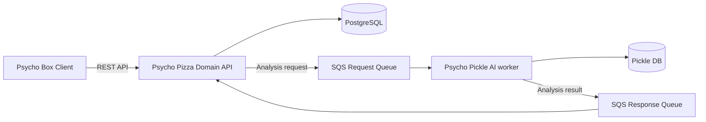

# Pizza

Pizza는 워크스페이스, 프로젝트, 스프린트와 태스크를 관리하고 축적된 데이터를 Psycho Pickle에 전달해 AI 분석 리포트를 생성하는 백엔드 애플리케이션입니다.

## 시스템 관계



- **Box**는 사용자 인터페이스와 Pizza API의 클라이언트입니다.
- **Pizza**는 인증, 워크스페이스와 프로젝트 데이터, 분석 요청 lifecycle 및 분석 리포트를 관리합니다.
- **Pickle**은 분석 작업을 받아 LLM을 호출하고 처리 결과를 Pizza에 통지합니다.

분석 파이프라인의 상태, 메시지와 실패 처리 규칙은 [분석 파이프라인 문서](docs/analysis-pipeline/)에서 관리합니다.

## 기술 스택

- Kotlin 2.2, Java 21
- Spring Boot 3.5
- Spring Data JPA, PostgreSQL, Flyway
- AWS SQS
- Gradle
- JUnit 5, MockK, Testcontainers

## 프로젝트 구조

```text
src/main/kotlin/pizza/psycho/sos/
├── identity/       인증, 계정과 보안
├── workspace/      워크스페이스와 멤버십
├── project/        프로젝트, 스프린트와 태스크
├── analysis/       분석 요청, 메트릭, 리포트와 SQS 연동
├── audit/          감사 이벤트와 이력
└── common/         공통 응답, 예외, 설정과 메시지 기능

src/main/resources/
├── db/migration/   Flyway migration
└── db/seed/        개발 및 평가용 seed 자료
```

각 기능 영역은 필요한 범위에서 `presentation`, `application`, `domain`, `infrastructure` 계층으로 나뉩니다.

## 실행 환경

다음 도구와 외부 자원이 필요합니다.

- JDK 21
- PostgreSQL
- 분석 메시지를 처리할 때 사용할 AWS 자격 증명과 SQS queue
- 메일 또는 OpenAI 연동 기능을 사용할 때 필요한 계정 설정

필요한 환경변수는 [`.env.template`](.env.template), Spring 설정과 배포 스크립트에서 확인할 수 있습니다. 템플릿은 로컬 설정을 시작하기 위한 참고 자료이며 실제 비밀값을 저장소에 커밋하지 마세요.

Spring이 프로젝트 루트의 `.env` 파일을 직접 읽지는 않으므로 로컬 셸에 값을 먼저 내보낸 뒤 실행합니다.

```bash
cp .env.template .env
# .env의 값을 로컬 환경에 맞게 채운다.
set -a
source .env
set +a
./gradlew bootRun
```

기본 활성 프로필은 `prod`이며 PostgreSQL과 외부 연동 설정을 환경변수에서 읽습니다. 로컬 실행에서도 `SPRING_PROFILES_ACTIVE`와 외부 자원 설정을 명시적으로 확인하세요.

## 검증

```bash
# 기본 테스트(integration, tc 태그 제외)
./gradlew test

# Kotlin formatting 검사
./gradlew ktlintCheck

# integration 태그가 붙은 테스트
./gradlew integrationTest

# PostgreSQL Testcontainers 테스트
./gradlew testTc

# 실행 가능한 JAR 생성
./gradlew bootJar
```

기본 `test` task는 `integration`, `tc` 태그가 붙은 테스트를 제외합니다. `testTc`를 실행하려면 Docker가 필요합니다.

## API와 상태 확인

애플리케이션 실행 후 다음 기본 endpoint를 사용할 수 있습니다.

- Swagger UI: `/swagger-ui/index.html`
- OpenAPI 문서: `/v3/api-docs`
- Health check: `/actuator/health`

업무 API는 `/api/v1` 아래에 있으며 대부분 인증과 워크스페이스 권한을 요구합니다.

## 데이터베이스 변경

- 운영 schema는 Flyway가 관리하며 Hibernate `ddl-auto`는 `none`입니다.
- 적용된 migration 파일을 수정하지 않고 `src/main/resources/db/migration/`에 새 migration을 추가합니다.
- migration과 이를 사용하는 애플리케이션 코드가 함께 배포될 수 있도록 호환성을 검토합니다.

## CI/CD

GitHub Actions는 `main`, `develop` 대상 pull request와 두 branch의 push에서 `ktlintCheck`와 기본 `test` task를 실행하도록 구성되어 있습니다. CI의 기본 검증에는 `integrationTest`와 `testTc`가 포함되지 않습니다.

`main` push에서는 다음 배포 절차가 실행되도록 구성되어 있습니다.

1. `bootJar`로 애플리케이션 JAR를 생성합니다.
2. JAR, `appspec.yml`, systemd unit과 배포 script를 ZIP bundle로 묶어 S3에 게시합니다.
3. AWS CodeDeploy가 bundle을 Ubuntu 서버의 `/home/ubuntu/app`에 배치합니다.
4. 배포 script가 AWS SSM Parameter Store에서 운영 환경값을 읽어 `.env`를 생성하고 systemd 서비스를 시작합니다.
5. `/actuator/health`가 응답하는지 확인해 배포를 검증합니다.

이 내용은 저장소에 선언된 workflow와 script의 동작을 설명합니다. 실제 AWS 리소스 상태나 최근 배포 성공 여부를 보장하지는 않습니다.

## 문서

문서는 다음 기준으로 관리합니다.

- [프로젝트 문서 지도](docs/README.md)
- [분석 파이프라인](docs/analysis-pipeline/): 분석 lifecycle, 메시지 계약과 실패 처리 정책
- [Architecture Decision Records](docs/adr/): 장기적인 영향을 주는 기술 결정

문서 작성 및 변경 규칙은 [AGENTS.md](AGENTS.md)를 따릅니다.
