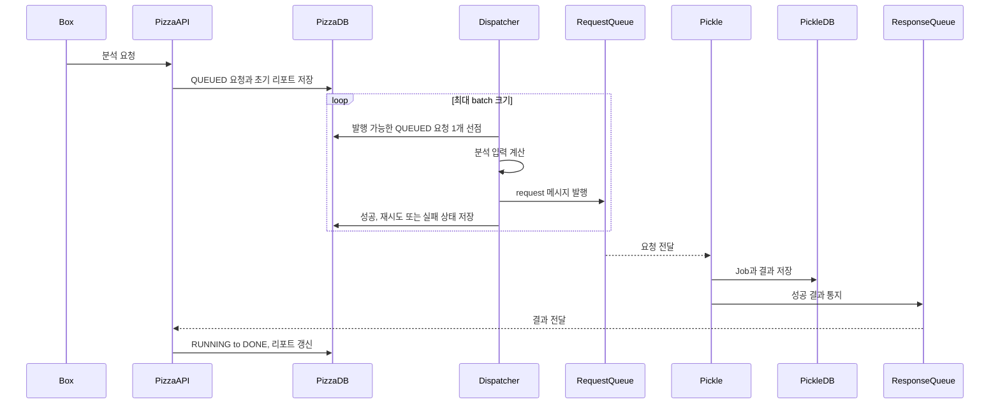
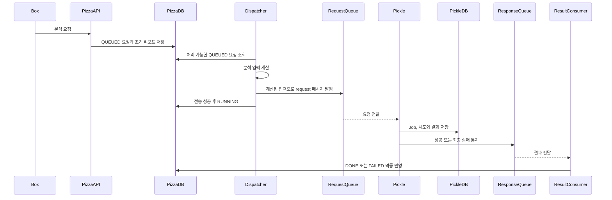

# 분석 파이프라인

## 목적

Pizza–Pickle 분석 파이프라인은 Pizza가 보유한 스프린트 데이터를 분석 입력으로 만들고 Pickle이 LLM을 호출해 생성한 결과를 Pizza의 분석 리포트로 저장합니다.

이 문서는 전체 흐름과 시스템 책임의 진입점입니다. 상태 전이, 메시지 필드와 실패 처리의 세부 기준은 각각의 정본 문서에서 관리합니다.

## 문서 지도

| 질문 | 정본 문서 |
| --- | --- |
| 요청 상태는 무엇을 의미하고 어떻게 전이하는가? | [분석 요청 lifecycle](lifecycle.md) |
| Pizza와 Pickle이 어떤 JSON을 교환하는가? | [Pizza–Pickle 메시지 계약](message-contract.md) |
| 어떤 오류를 재시도하고 언제 최종 실패로 처리하는가? | [분석 실패 처리 정책](failure-policy.md) |
| 왜 Pizza DB를 lifecycle 기준으로 사용하는가? | [ADR 0001](../adr/0001-use-pizza-db-as-analysis-lifecycle-source.md) |
| 왜 중복 전달을 허용하고 consumer를 멱등하게 만드는가? | [ADR 0002](../adr/0002-handle-analysis-messages-idempotently.md) |
| 왜 분석 요청을 요청별 transaction으로 발행하는가? | [ADR 0003](../adr/0003-dispatch-analysis-requests-in-individual-transactions.md) |

향후 정책과 운영 절차가 확정되면 다음 문서를 추가합니다.

| 문서 | 책임 |
| --- | --- |
| `testing.md` | 정책별 자동화 테스트와 통합·장애·부하 테스트 범위 |
| `operations.md` | 장애 확인, 복구, 재처리와 관측 절차 |

## 시스템 책임

| 구성요소 | 책임 |
| --- | --- |
| Box | Pizza REST API를 사용하는 사용자 인터페이스 |
| Pizza API | 분석 요청 생성과 조회, 분석 입력 생성 |
| Pizza DB | 분석 요청 lifecycle과 최종 리포트 저장 |
| SQS request queue | Pizza의 분석 요청을 Pickle에 전달 |
| Pickle | 요청별 Job 관리, LLM 호출과 결과 저장 |
| SQS response queue | Pickle의 성공 또는 최종 실패 결과를 Pizza에 전달 |
| Pizza result consumer | 결과 검증, lifecycle 전이와 리포트 반영 |

Box는 고도화 범위에서 수정하지 않으며 기존 Box–Pizza API 스펙을 유지합니다.

## 현재 흐름

현재 구현의 기준과 제약은 다음과 같다.

- Pizza DB의 `QUEUED` 요청이 실행 대기열의 기준이다.
- Dispatcher는 PostgreSQL `FOR UPDATE SKIP LOCKED`로 요청을 하나씩 선점하고 요청별 transaction에서 처리한다.
- Pizza는 SQS 전송에 성공한 요청만 `RUNNING`으로 변경한다.
- Pizza는 SQS 발행 시도 횟수와 다음 재시도 시각을 저장하고 일시 오류를 최대 3회까지 재시도한다.
- 입력 생성이나 영구 발행 오류, 재시도 소진은 `FAILED`로 종료한다.
- 애플리케이션 시작만을 이유로 `RUNNING` 요청을 되돌리지 않고 10분 넘게 정체된 요청만 복구한다.
- 요청별 transaction은 SQS 발행이 끝날 때까지 선점한 row lock을 유지한다. DB commit과 SQS 발행 사이의 경계 장애 개선은 별도 이슈에서 검토한다.
- Pizza의 result consumer는 성공 결과를 전제로 하며 최종 실패 payload를 안전하게 처리하지 못한다.
- 동일 결과가 반복 전달되면 종료 상태 전이에서 예외가 발생할 수 있다.

## 목표 흐름

목표 흐름의 기준은 다음과 같습니다.

- Pizza DB를 분석 요청 lifecycle의 기준으로 사용합니다.
- Pizza Dispatcher는 DB에서 처리 가능한 요청을 선점하고 분석 입력을 계산한 뒤 request 메시지를 발행합니다.
- SQS 전송 성공 후 `RUNNING`으로 변경합니다.
- 같은 `analysisRequestId`로 제한된 재시도와 [`stale job`](failure-policy.md#stale-job-복구) 복구를 수행합니다.
- 성공, 최종 실패와 중복 결과를 Pizza가 안전하게 처리합니다.
- SQS 중복 전달을 전제로 Pizza와 Pickle consumer를 멱등하게 만듭니다.
- 부하 테스트에는 fake LLM을 사용하고 실제 OpenAI API는 소규모 품질 평가에만 사용합니다.
- 대규모 아키텍처 개편보다 분석 파이프라인에 필요한 범위의 변경을 우선합니다.

Pizza request queue 발행의 backoff 계산과 설정값은 [실패 처리 정책](failure-policy.md)에서 관리한다.

## 문서 동기화

- 분석 상태 또는 전이 조건을 변경하면 [lifecycle](lifecycle.md)과 관련 테스트를 함께 검토합니다.
- SQS DTO 또는 직렬화 형식을 변경하면 [메시지 계약](message-contract.md)과 Pizza·Pickle의 DTO, 소비 코드와 테스트를 함께 검토합니다.
- 메시지 계약에는 필드 타입, 필수 여부, 의미와 대표 JSON 예제를 포함합니다.
- 재시도, 복구, 멱등성 또는 DLQ 동작을 변경하면 [실패 처리 정책](failure-policy.md)과 관련 테스트·운영 절차를 함께 검토합니다.
- 정상 경로뿐 아니라 중복 전달, 순서 역전, 알 수 없는 요청과 잘못된 payload를 문서와 테스트에서 다룹니다.

## GitHub 작업 연결

| 범위 | GitHub 작업 | 상태 |
| --- | --- | --- |
| Pizza lifecycle 동작 고정 | [Pizza #2](https://github.com/dawwson/psycho.pizza/issues/2) | 완료 |
| Pickle 작업 처리·복구 동작 고정 | [Pickle #1](https://github.com/dawwson/psycho.pickle/issues/1) | 완료 |
| Pizza DB Dispatcher 구현 | [Pizza #20](https://github.com/dawwson/psycho.pizza/issues/20) | 완료 |
| Pizza 발행 retry와 `stale job` 복구 | [Pizza #21](https://github.com/dawwson/psycho.pizza/issues/21) | 현재 브랜치에서 구현, 이슈 OPEN |
| Pizza 결과 실패 계약과 멱등 처리 | [Pizza #22](https://github.com/dawwson/psycho.pizza/issues/22) | OPEN |
| Pizza–Pickle 메시지 contract 검증 | [Pizza #18](https://github.com/dawwson/psycho.pizza/issues/18) | OPEN |
| Pickle 제출·통지·복구 책임 분리 | [Pickle #5](https://github.com/dawwson/psycho.pickle/issues/5) | OPEN |
| Pickle LLM 오류 분류와 제한 재시도 | [Pickle #6](https://github.com/dawwson/psycho.pickle/issues/6) | OPEN |
| PostgreSQL·SQS·DLQ 장애 복구 검증 | [Pizza #23](https://github.com/dawwson/psycho.pizza/issues/23) | OPEN |
| Dispatcher의 DB transaction과 SQS 발행 경계 검토 | [Pizza #32](https://github.com/dawwson/psycho.pizza/issues/32) | OPEN |

Pickle 최종 실패와 Pizza result consumer의 멱등 처리 등 후속 작업은 구현이 완료되기 전까지 현재 동작으로 간주하지 않는다.
