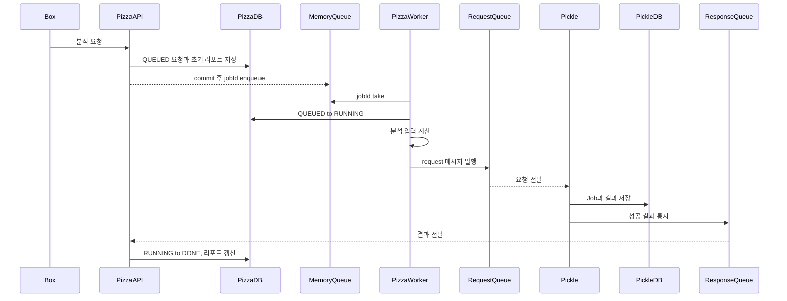

# 분석 파이프라인

## 목적

Pizza–Pickle 분석 파이프라인은 Pizza가 보유한 스프린트 데이터를 분석 입력으로 만들고 Pickle이 LLM을 호출해 생성한 결과를 Pizza의 분석 리포트로 저장합니다.

이 문서는 전체 흐름과 시스템 책임의 진입점입니다. 상태 전이, 메시지 필드와 실패 처리의 세부 기준은 각각의 정본 문서에서 관리합니다.

## 문서 지도

| 질문 | 정본 문서 |
| --- | --- |
| 요청 상태는 무엇을 의미하고 어떻게 전이하는가? | [분석 요청 lifecycle](lifecycle.md) |
| Pizza와 Pickle이 어떤 JSON을 교환하는가? | [Pizza–Pickle 메시지 계약](message-contract.md) |
| 어떤 오류를 재시도하고 언제 최종 실패로 처리하는가? | [분석 실패 처리 정책](failure-policy.md) |
| 왜 Pizza DB를 lifecycle 기준으로 사용하는가? | [ADR 0001](../adr/0001-use-pizza-db-as-analysis-lifecycle-source.md) |
| 왜 중복 전달을 허용하고 consumer를 멱등하게 만드는가? | [ADR 0002](../adr/0002-handle-analysis-messages-idempotently.md) |

## 시스템 책임

| 구성요소 | 책임 |
| --- | --- |
| Box | Pizza REST API를 사용하는 사용자 인터페이스 |
| Pizza API | 분석 요청 생성과 조회, 분석 입력 생성 |
| Pizza DB | 분석 요청 lifecycle과 최종 리포트 저장 |
| SQS request queue | Pizza의 분석 요청을 Pickle에 전달 |
| Pickle | 요청별 Job 관리, LLM 호출과 결과 저장 |
| SQS response queue | Pickle의 성공 또는 최종 실패 결과를 Pizza에 전달 |
| Pizza result consumer | 결과 검증, lifecycle 전이와 리포트 반영 |

Box는 고도화 범위에서 수정하지 않으며 기존 Box–Pizza API 스펙을 유지합니다.

## 현재 흐름

현재 구현에는 다음 제약이 있습니다.

- Pizza의 내부 대기열이 프로세스 메모리에 있어 DB 상태와 별도로 관리됩니다.
- Pizza는 SQS 전송 전에 요청을 `RUNNING`으로 변경합니다.
- Pizza 재시작 시 모든 `RUNNING` 요청을 `QUEUED`로 되돌립니다.
- Pizza의 result consumer는 성공 결과를 전제로 하며 최종 실패 payload를 안전하게 처리하지 못합니다.
- 동일 결과가 반복 전달되면 종료 상태 전이에서 예외가 발생할 수 있습니다.

## 목표 흐름

목표 흐름의 기준은 다음과 같습니다.

- Pizza DB를 분석 요청 lifecycle의 기준으로 사용합니다.
- Pizza worker는 유지하되 작업 조회 기준을 인메모리 큐에서 Pizza DB로 변경합니다.
- Pizza worker는 현재와 같이 분석 입력을 계산한 뒤 request 메시지를 발행합니다.
- SQS 전송 성공 후 `RUNNING`으로 변경합니다.
- 같은 `analysisRequestId`로 제한된 재시도와 [`stale job`](lifecycle.md#stale-job) 복구를 수행합니다.
- 성공, 최종 실패와 중복 결과를 Pizza가 안전하게 처리합니다.
- SQS 중복 전달을 전제로 Pizza와 Pickle consumer를 멱등하게 만듭니다.

구체적인 backoff, timeout과 SQS 설정값은 담당 구현 및 테스트 PR에서 결정합니다.

## 후속 작업 연결

| 범위 | 담당 PR |
| --- | --- |
| Pizza 현재 lifecycle을 테스트로 고정 | PR 2 |
| Pickle 중복·통지·복구 동작을 테스트로 고정 | PR 3 |
| Pizza DB Dispatcher와 재시도 정보 추가 | PR 4 |
| Pizza 재시도와 `stale job` 복구 구현 | PR 5 |
| Pizza 결과 실패 계약과 멱등 처리 구현 | PR 6 |
| Pickle 제출·통지·복구 책임 분리 | PR 7 |
| Pickle LLM 오류 분류와 제한 재시도 구현 | PR 8 |
| 실제 PostgreSQL·SQS·DLQ 장애 복구 검증 | PR 9 |

후속 PR이 완료되기 전에는 목표 흐름을 현재 동작으로 간주하지 않습니다.
