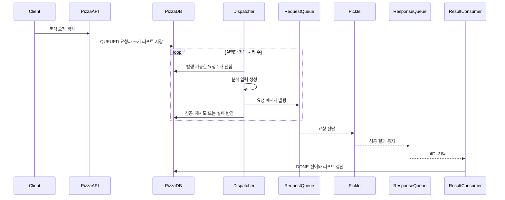

# 분석 파이프라인

## 목적

이 문서는 Pizza가 분석 요청을 만들고 Pickle의 결과를 리포트로 저장하는 전체 흐름과 시스템 경계를 설명한다. 상태 전이, 메시지 필드와 실패 처리의 상세 규칙은 각 정본 문서에서 관리한다.

## 문서 지도

| 질문 | 정본 문서 |
| --- | --- |
| 분석 요청 상태는 무엇을 의미하고 어떻게 전이하는가? | [분석 요청 lifecycle](lifecycle.md) |
| Pizza와 Pickle이 어떤 JSON을 교환하는가? | [Pizza–Pickle 메시지 계약](message-contract.md) |
| 어떤 오류를 재시도하고 언제 최종 실패로 처리하는가? | [분석 실패 처리 정책](failure-policy.md) |
| 왜 Pizza DB를 lifecycle 기준으로 사용하는가? | [ADR 0001](../adr/0001-use-pizza-db-as-analysis-lifecycle-source.md) |
| 왜 중복 전달을 허용하고 consumer를 멱등하게 만드는가? | [ADR 0002](../adr/0002-handle-analysis-messages-idempotently.md) |
| 왜 요청별 transaction으로 SQS에 발행하는가? | [ADR 0003](../adr/0003-dispatch-analysis-requests-in-individual-transactions.md) |

## 시스템 경계

| 구성요소 | 책임 |
| --- | --- |
| Box | Pizza REST API를 통해 분석을 요청하고 상태와 리포트를 조회 |
| Pizza API | 분석 요청과 초기 리포트 생성, 분석 결과 조회 |
| Pizza Dispatcher | Pizza DB에서 발행 가능한 요청 선점, 입력 생성과 request queue 발행 |
| Pizza recovery | 정체된 `RUNNING` 요청을 재발행 대기 또는 최종 실패로 전환 |
| Pizza DB | Pizza가 소유하는 분석 lifecycle과 최종 리포트 저장 |
| Pickle | 요청 ID별 작업 관리, LLM 호출과 최종 결과 통지 |
| Pizza result consumer | Pickle 결과 검증, lifecycle 전이와 리포트 반영 |

SQS는 Pizza와 Pickle 사이에서 메시지를 한 번 이상 전달할 수 있다. 두 시스템은 메시지 수신 횟수가 아니라 `analysisRequestId`에 대응하는 영속 상태를 처리 기준으로 사용한다.

Box–Pizza REST API는 이 파이프라인의 내부 메시지 계약과 분리한다. 이 작업에서는 기존 상태 이름과 응답 필드를 변경하지 않는다.

## 현재 흐름

현재 Pizza Dispatcher는 다음 기준으로 동작한다.

- `next_retry_at`이 없거나 현재 시각이 지난 `QUEUED` 요청을 하나씩 선점한다.
- 한 번의 실행에서 최대 10개를 처리하며 요청마다 별도 transaction을 사용한다.
- SQS 발행 성공만 `RUNNING`으로 전환한다.
- 일시적인 발행 오류는 제한된 backoff 후 재시도하고, 영구 오류와 시도 소진은 `FAILED`로 종료한다.
- 애플리케이션 시작을 이유로 상태를 초기화하지 않고 10분 넘게 정체된 `RUNNING`만 복구한다.

요청별 transaction은 외부 SQS 호출이 끝날 때까지 선점한 row lock을 유지한다. SQS 발행 성공과 DB commit 사이의 경계 장애에서는 같은 요청이 중복 발행될 수 있으며, 현재는 동일 `analysisRequestId`의 멱등 처리로 수용한다. 이 경계의 추가 개선은 [Pizza #32](https://github.com/dawwson/psycho.pizza/issues/32)에서 검토한다.

현재 Pizza result consumer는 성공 결과만 처리한다. 최종 실패 결과와 중복·충돌 결과의 멱등 처리는 아직 구현되지 않았다.

## 구현 상태

| 범위 | GitHub 작업 | 상태 |
| --- | --- | --- |
| Pizza lifecycle 동작 고정 | [Pizza #2](https://github.com/dawwson/psycho.pizza/issues/2) | 완료 |
| Pickle 작업 처리·복구 동작 고정 | [Pickle #1](https://github.com/dawwson/psycho.pickle/issues/1) | 완료 |
| Pizza DB Dispatcher | [Pizza #20](https://github.com/dawwson/psycho.pizza/issues/20) | 완료 |
| Pizza 발행 retry와 `stale job` 복구 | [Pizza #21](https://github.com/dawwson/psycho.pizza/issues/21) | 현재 브랜치에서 구현, 이슈 OPEN |
| Pizza 결과 실패 계약과 멱등 처리 | [Pizza #22](https://github.com/dawwson/psycho.pizza/issues/22) | OPEN |
| Pizza–Pickle contract 검증 | [Pizza #18](https://github.com/dawwson/psycho.pizza/issues/18) | OPEN |
| Pickle 제출·통지·복구 책임 분리 | [Pickle #5](https://github.com/dawwson/psycho.pickle/issues/5) | OPEN |
| Pickle LLM 제한 retry와 최종 실패 통지 | [Pickle #6](https://github.com/dawwson/psycho.pickle/issues/6) | OPEN |
| PostgreSQL·SQS·DLQ 장애 복구 검증 | [Pizza #23](https://github.com/dawwson/psycho.pizza/issues/23) | OPEN |
| Dispatcher transaction과 SQS 발행 경계 검토 | [Pizza #32](https://github.com/dawwson/psycho.pizza/issues/32) | OPEN |

OPEN 작업의 목표 동작은 해당 구현과 검증이 완료되기 전까지 현재 동작으로 간주하지 않는다.

## 문서 동기화

- 상태 의미나 전이 조건을 변경하면 [lifecycle](lifecycle.md)과 관련 테스트를 함께 검토한다.
- SQS DTO나 직렬화 형식을 변경하면 [메시지 계약](message-contract.md)과 Pizza·Pickle 양쪽 소비 코드 및 테스트를 함께 검토한다.
- retry, 복구, 멱등성이나 DLQ 동작을 변경하면 [실패 처리 정책](failure-policy.md)과 장애 시나리오 테스트를 함께 검토한다.
- 구현과 문서가 다르면 현재 구현을 기준으로 차이를 명시하고 미구현 목표를 분리한다.
