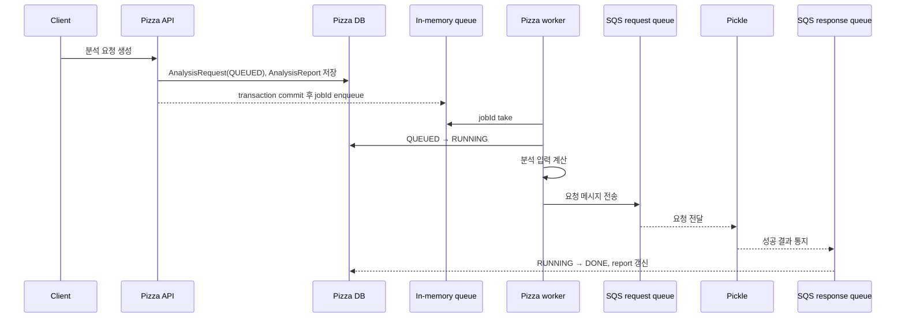
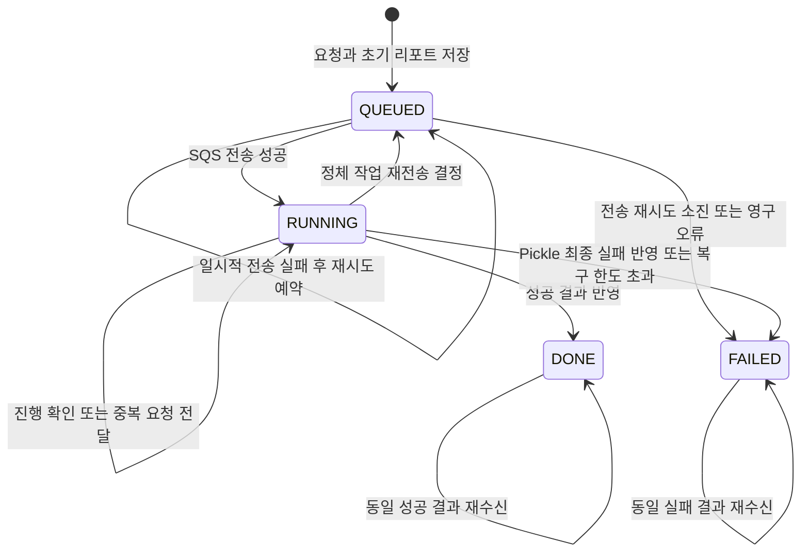

# 분석 요청 lifecycle

## 목적

이 문서는 Pizza가 소유하는 분석 요청 상태의 의미와 전이 조건을 정의합니다. 상태는 내부 thread의 실행 여부가 아니라 사용자가 조회할 수 있는 분석 요청의 처리 단계를 나타냅니다.

Pizza DB의 `analysis_request`를 lifecycle의 기준으로 사용하는 이유는 [ADR 0001](../adr/0001-use-pizza-db-as-analysis-lifecycle-source.md)에 기록합니다.

## 현재 구현

현재 흐름은 다음과 같습니다.

현재 코드에서 확인되는 동작은 다음과 같습니다.

| 상황 | 현재 동작 |
| --- | --- |
| 요청 생성 | 요청과 초기 리포트를 저장하고 `QUEUED` 반환 |
| Pizza worker가 작업 시작 | SQS 전송 전에 `RUNNING`으로 변경 |
| 입력 계산 또는 SQS 전송 실패 | `RUNNING`을 `FAILED`로 변경하고 예외 기록 |
| 성공 결과 수신 | `RUNNING`을 `DONE`으로 변경하고 리포트에 결과 저장 |
| 애플리케이션 재시작 | 모든 `RUNNING`을 `QUEUED`로 되돌린 뒤 모든 `QUEUED`를 인메모리 큐에 추가 |

현재 성공 결과 소비자는 성공 payload만 처리합니다. Pickle의 최종 실패 통지, 중복 성공 결과와 종료 상태에 늦게 도착한 메시지를 안전하게 수렴시키는 동작은 아직 구현되어 있지 않습니다.

## 목표 상태 의미

| 상태 | 의미 | 진입 시점 | 종료 시 기록 |
| --- | --- | --- | --- |
| `QUEUED` | Pizza DB에 요청이 저장됐으며 Pickle 전달을 기다리거나 다음 전송 시각을 기다리는 상태 | 요청 생성 또는 제한된 복구 | 전송 시도 정보 갱신 |
| `RUNNING` | SQS request queue 전송이 성공해 Pickle의 최종 결과를 기다리는 상태 | Dispatcher의 전송 성공 | `started_at` 기록 |
| `DONE` | 성공 결과가 반영되고 분석 리포트를 조회할 수 있는 종료 상태 | 유효한 성공 결과 반영 | `completed_at` 기록, 오류 정보 제거 |
| `FAILED` | Pizza 또는 Pickle에서 복구 불가능한 최종 실패로 판정한 종료 상태 | 재시도 소진 또는 최종 실패 결과 반영 | `completed_at`, 실패 코드와 설명 기록 |

`DONE`과 `FAILED`는 종료 상태입니다. 동일 메시지의 재처리는 기존 결과를 유지해야 하며 새로운 상태 전이나 리포트 중복 갱신을 만들지 않아야 합니다.

## 목표 상태 전이

### 허용 전이

| 현재 상태 | 다음 상태 | 주체 | 조건 |
| --- | --- | --- | --- |
| 없음 | `QUEUED` | Pizza API | 요청과 초기 리포트 저장이 함께 성공 |
| `QUEUED` | `QUEUED` | Pizza Dispatcher | 재시도 가능한 전송 오류이며 최대 시도에 도달하지 않음 |
| `QUEUED` | `RUNNING` | Pizza Dispatcher | SQS request queue 전송 성공 |
| `QUEUED` | `FAILED` | Pizza Dispatcher | 영구 오류 또는 전송 재시도 소진 |
| `RUNNING` | `QUEUED` | Pizza recovery | 정체 작업 기준을 만족하고 재전송 한도가 남음 |
| `RUNNING` | `DONE` | Pizza result consumer | 요청 ID가 일치하는 유효한 성공 결과를 최초 반영 |
| `RUNNING` | `FAILED` | Pizza result consumer 또는 recovery | Pickle의 최종 실패 결과를 반영하거나 복구 한도를 초과 |

자기 전이는 상태 변경이 아니라 동일 작업의 재확인 또는 중복 메시지 수신을 표현합니다. 시도 횟수나 마지막 수신 시각 같은 부가 정보는 바뀔 수 있지만 lifecycle 결과는 바뀌지 않습니다.

### 허용하지 않는 전이

| 전이 | 처리 원칙 |
| --- | --- |
| `QUEUED` → `DONE` | 전달과 실행 단계를 건너뛴 결과이므로 자동 완료하지 않음 |
| `DONE` → `RUNNING` 또는 `QUEUED` | 완료된 요청을 다시 열지 않음 |
| `FAILED` → `RUNNING` 또는 `QUEUED` | 최종 실패 요청을 자동으로 다시 열지 않음 |
| `DONE` ↔ `FAILED` | 먼저 확정된 종료 결과를 다른 종료 상태로 덮어쓰지 않음 |

최종 실패 이후 사용자가 다시 분석을 요청하면 기존 요청을 되살리지 않고 새로운 `analysisRequestId`를 생성합니다.

## 상태별 책임

### Pizza API

- 요청과 초기 리포트를 같은 트랜잭션에서 저장합니다.
- 외부 응답에는 기존 상태 이름과 필드를 유지합니다.
- 요청 생성 성공은 Pickle 전달 성공을 의미하지 않습니다.

### Pizza Dispatcher

- 전송 가능한 `QUEUED` 요청을 DB에서 조회합니다.
- 전송 시도와 다음 재시도 가능 시각을 영속화합니다.
- SQS 전송 성공 후 `RUNNING`으로 전환합니다.
- 영구 오류 또는 최대 시도 초과를 `FAILED`로 확정합니다.

### Pickle

- `analysisRequestId`에 대응하는 외부 요청 ID를 작업 식별자로 유지합니다.
- 동일 요청을 다시 받아도 별개의 LLM 작업을 무제한 생성하지 않습니다.
- 성공 또는 최종 실패 결과를 Pizza에 통지합니다.

### Pizza result consumer

- 성공과 최종 실패 결과를 요청 ID 기준으로 반영합니다.
- 같은 결과가 반복 전달돼도 종료 상태와 리포트를 중복 변경하지 않습니다.
- 종료 상태와 충돌하는 결과는 기존 상태를 덮어쓰지 않고 기록 가능한 형태로 남깁니다.

## 정체 작업 복구 원칙

정체 작업(stale job)은 정상 처리 제한 시간을 초과했지만 종료 상태로 전환되지 않은 `QUEUED` 또는 `RUNNING` 분석 요청입니다. 상태 이름만으로 정체 여부를 판단하지 않고 마지막 시도 시각, 다음 시도 가능 시각, 상태 체류 시간과 최대 시도 횟수를 함께 사용합니다.

- `QUEUED`: `next_retry_at`이 현재 시각 이전인 요청만 Dispatcher 대상이 됩니다.
- `RUNNING`: 정상 처리 제한 시간을 넘긴 요청만 복구 후보가 됩니다.
- 복구 한도가 남은 `RUNNING`은 `QUEUED`로 전환해 같은 요청 ID로 재전송합니다.
- 복구 한도를 초과한 요청은 `FAILED`로 종료합니다.
- 애플리케이션 시작만을 이유로 모든 `RUNNING`을 즉시 `QUEUED`로 바꾸지 않습니다.

구체적인 제한 횟수, backoff, 오류 분류와 메시지 충돌 처리 방식은 실패 처리 정책에서 정의합니다.

## 구현 차이

이 문서는 후속 구현이 따라야 할 목표 lifecycle을 포함합니다. 현재 코드와의 주요 차이는 다음과 같습니다.

| 항목 | 현재 | 목표 |
| --- | --- | --- |
| Pizza 내부 실행 대기열 | `InMemoryAnalysisJobQueue` | DB 조회 기반 Dispatcher |
| `RUNNING` 진입 | Pizza worker 처리 시작 전 | SQS 전송 성공 후 |
| 재시도 정보 | 영속 정보 없음 | 시도 횟수와 시각을 DB에 저장 |
| 재시작 복구 | 모든 `RUNNING`을 즉시 `QUEUED`로 변경 | 시간과 시도 한도로 정체 요청만 판정 |
| 최종 전송 실패 | worker 예외를 즉시 `FAILED`로 처리 | 오류를 분류하고 제한 재시도 후 `FAILED` |
| Pickle 최종 실패 | 소비 계약 없음 | 실패 결과를 받아 `FAILED` 반영 |
| 중복 결과 | 상태 전이 예외 발생 가능 | 동일 결과를 멱등하게 수용 |

후속 구현이 완료되기 전에는 목표 정책을 현재 동작으로 간주하지 않습니다.
