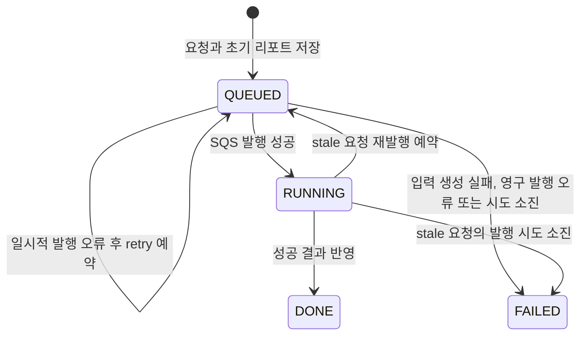

# 분석 요청 lifecycle

## 목적

이 문서는 Pizza가 소유하는 분석 요청 상태의 의미와 허용 전이를 정의한다. 상태는 내부 thread 실행 여부가 아니라 사용자가 조회할 수 있는 처리 단계를 나타낸다.

Pizza DB를 lifecycle의 기준으로 선택한 이유는 [ADR 0001](../adr/0001-use-pizza-db-as-analysis-lifecycle-source.md), 요청별 transaction으로 발행하는 이유는 [ADR 0003](../adr/0003-dispatch-analysis-requests-in-individual-transactions.md)에 기록한다. 오류 분류와 retry·복구 수치는 [실패 처리 정책](failure-policy.md)에서 관리한다.

## 상태 의미

| 상태 | 의미 | 주요 기록 |
| --- | --- | --- |
| `QUEUED` | Pickle 전달 또는 다음 발행 가능 시각을 기다리는 상태 | `attempt_count`, `last_attempt_at`, `next_retry_at` |
| `RUNNING` | request queue 발행에 성공해 Pickle의 결과를 기다리는 상태 | `started_at` |
| `DONE` | 성공 결과와 분석 리포트가 반영된 종료 상태 | `completed_at` |
| `FAILED` | Pizza가 복구 불가능하거나 재시도를 소진했다고 판정한 종료 상태 | `completed_at`, `error_message` |

`RUNNING`은 Pizza 내부 작업이 실행 중이라는 뜻이 아니다. SQS 발행이 성공해 Pickle에 전달될 수 있는 상태가 됐다는 뜻이다.

`DONE`과 `FAILED`는 종료 상태이다. 사용자가 다시 분석하려면 기존 요청을 되살리지 않고 새로운 `analysisRequestId`를 생성한다.

## 현재 상태 전이

| 현재 상태 | 다음 상태 | 주체 | 조건 |
| --- | --- | --- | --- |
| 없음 | `QUEUED` | Pizza API | 요청과 초기 리포트 저장이 함께 성공 |
| `QUEUED` | `QUEUED` | Pizza Dispatcher | 일시적 SQS 오류이며 발행 시도가 남음 |
| `QUEUED` | `RUNNING` | Pizza Dispatcher | SQS request queue 발행 성공 |
| `QUEUED` | `FAILED` | Pizza Dispatcher | 입력 생성 실패, 영구 발행 오류 또는 발행 시도 소진 |
| `RUNNING` | `QUEUED` | Pizza recovery | stale 기준을 만족하고 발행 시도가 남음 |
| `RUNNING` | `DONE` | Pizza result consumer | 유효한 성공 결과를 반영 |
| `RUNNING` | `FAILED` | Pizza recovery | 발행 시도를 모두 사용한 요청이 stale로 판정됨 |

## 허용하지 않는 전이

| 전이 | 처리 원칙 |
| --- | --- |
| `QUEUED` → `DONE` | 전달 단계를 건너뛴 결과이므로 완료하지 않음 |
| `DONE` → `RUNNING` 또는 `QUEUED` | 완료된 요청을 다시 열지 않음 |
| `FAILED` → `RUNNING` 또는 `QUEUED` | 최종 실패 요청을 자동으로 다시 열지 않음 |
| `DONE` ↔ `FAILED` | 먼저 확정된 종료 결과를 다른 종료 상태로 덮어쓰지 않음 |

현재 entity는 허용하지 않는 상태 전이에서 예외를 발생시킨다.

## 발행과 복구 책임

### Pizza Dispatcher

- 발행 가능한 `QUEUED` 요청을 요청별 transaction에서 하나씩 선점한다.
- 발행 전에 시도 횟수와 시각을 기록한다.
- SQS 발행 성공 후에만 `RUNNING`으로 전환한다.
- 일시 오류는 retry를 예약하고 영구 오류나 시도 소진은 `FAILED`로 확정한다.

### Pizza recovery

- `started_at`이 stale 기준을 지난 `RUNNING`만 제한된 batch로 선점한다.
- 발행 시도가 남았으면 같은 요청 ID를 유지한 채 `QUEUED`로 전환한다.
- 발행 시도를 모두 사용했으면 추가 발행 없이 `FAILED`로 종료한다.
- 직접 SQS에 발행하지 않고 Dispatcher가 다시 발견하도록 상태만 변경한다.

애플리케이션 시작 자체는 복구 조건이 아니다. fresh `RUNNING`은 변경하지 않는다.

## 미구현 목표

현재 Pizza result consumer는 성공 결과만 처리하며 중복 결과를 멱등하게 수용하지 못한다. 다음 전이는 [Pizza #22](https://github.com/dawwson/psycho.pizza/issues/22)의 목표이다.

| 상황 | 목표 |
| --- | --- |
| Pickle 최종 실패 수신 | `RUNNING` → `FAILED` |
| 동일 성공 결과 재수신 | 기존 `DONE`과 리포트 유지 |
| 동일 실패 결과 재수신 | 기존 `FAILED`와 실패 정보 유지 |
| 종료 상태와 충돌하는 결과 수신 | 먼저 확정된 종료 상태 유지, 충돌 기록 |

이 목표는 Pizza #22 구현과 검증이 완료되기 전까지 현재 동작으로 간주하지 않는다.
