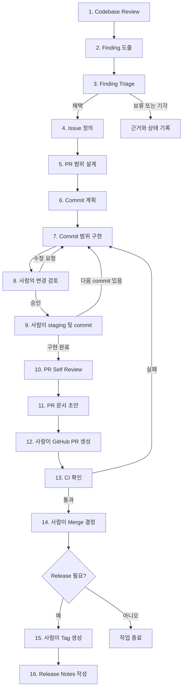

# Engineering Workflow v0.1

## 1. Purpose

이 문서는 Pizza 백엔드의 현재 개발 작업 방식을 반복 가능한 Working Agreement이자 SOP로 정리한다. 이상적인 조직 프로세스를 새로 설계하는 문서가 아니며, 1인 개발 환경에서 사람과 AI가 함께 조사하고 구현하되 최종 판단과 Git/GitHub 변경은 사람이 수행하는 현재 방식을 기준으로 한다.

적용 범위는 Codebase Review에서 Release Notes 초안 작성까지다. 브랜치, merge 방식과 버전 규칙은 [Git 브랜치·릴리스·커밋 운영 가이드](../conventions/git-workflow.md), 테스트 작성 방식은 [테스트 작성 원칙](../conventions/testing.md)을 정본으로 따른다.

### 확인된 저장소 현황

- Pizza는 인증, 워크스페이스, 프로젝트, 스프린트, 태스크와 분석 요청 lifecycle을 소유하는 Kotlin/Spring Boot 백엔드다.
- 기능 영역은 대체로 `presentation`, `application`, `domain`, `infrastructure` 경계를 사용한다.
- 로컬 검증 task는 `ktlintCheck`, `test`, `integrationTest`, `testTc`, `bootJar`다. `testTc`에는 Docker가 필요하다.
- PR template은 `.github/pull_request_template.md`에 있으며 `Summary`, `Why`, `Changes`, `How to Test`, `Notes`를 요구한다.
- 저장소 안에서 Issue template은 확인되지 않았다.
- Git history에는 이슈 번호를 포함한 최근 squash commit과 과거의 작은 commit, 중복 commit, branch merge가 함께 존재한다. 모든 과거 작업이 이 문서의 commit 분해 절차를 일관되게 따랐다고 보지는 않는다.
- GitHub Actions는 `main`, `develop`의 push와 PR에서 `ktlintCheck`, 기본 `test`를 실행한다. `integrationTest`와 `testTc`는 실행하지 않는다.
- 같은 workflow에는 `main` push 시 S3와 CodeDeploy를 사용하는 CD가 선언돼 있다. 이 설정은 기존 저장소에서 가져온 상태이며 Pizza에 맞는 설정인지, 실제로 사용 가능한지는 **확인 필요**다. 이 문서에서는 CD 자동화를 현재 workflow 범위로 채택하지 않는다.
- branch protection, required check, 실제 CI/CD 성공 이력, Issue label 및 project 운영 방식, 릴리스 승인 기록 위치는 로컬 저장소에서 **확인 필요**다.

## 2. Principles

1. 현재 동작과 근거를 먼저 확인하고, 확인할 수 없는 내용은 추측하지 않는다.
2. 작업은 `Finding → Triage → Issue → PR → Commit` 순서로 구체화한다. 모든 Finding을 Issue로 만들지 않는다.
3. 하나의 PR은 하나의 명확한 목적을 가진다. 작업 branch의 각 commit은 하나의 논리적 변경과 필요한 검증을 함께 담아 사람의 검토 단위로 사용한다. `feature/*`, `fix/*`, `docs/*`에서 `develop`로 병합할 때는 PR 전체를 **Squash and merge**하여 `develop`에는 하나의 통합 commit만 남긴다.
4. AI는 조사, 분석, 초안, 요청받은 범위의 변경과 검증을 수행할 수 있다. 사람은 채택, 우선순위, 기술 결정, 코드 승인과 Git/GitHub 상태 변경을 책임진다.
5. AI는 사람의 승인 없이 staging, commit, PR 생성, merge, tag 또는 release를 수행하지 않는다.
6. 현재 commit 범위를 넘어선 문제는 임의로 고치지 않고 별도 Finding으로 보고한다. 무관한 refactoring과 formatting을 섞지 않는다.
7. 코드 동작 변경에는 회귀 테스트를 포함하며, 변경 범위에 맞는 최소 검증을 실행한다.
8. Box–Pizza API 또는 Pizza–Pickle 메시지 계약처럼 저장소 경계를 넘는 변경은 관련 저장소의 소비 코드, DTO와 테스트까지 검토한다. 명시적 요청 없이 Box를 수정하지 않는다.
9. 새로운 기술이나 구조는 문제, 제약, 대안과 운영 영향을 검토한 뒤 사람이 승인한다. 장기적 Architecture Decision만 ADR 후보로 삼는다.
10. `main` merge와 release는 같은 사건이 아니다. 배포할 가치가 있고 사람이 승인한 변경만 별도 release로 만든다.

## 3. Workflow Overview

각 단계는 산출물과 Human Gate를 통과해야 다음 단계로 진행한다. 작은 문서 수정처럼 일부 산출물이 불필요한 작업은 해당 항목을 `N/A`로 명시할 수 있지만, 사람의 Git/GitHub Gate는 생략하지 않는다.

## 4. Workflow Stages

### 4.1 Codebase Review

#### Purpose

문제와 변경 범위를 현재 코드, 문서와 운영 제약에 근거해 이해한다.

#### Input

- 검토 목적 또는 사용자 요청
- `AGENTS.md`, `README.md`, 관련 `docs/`
- Issue/PR template, GitHub Actions, 빌드·테스트 설정
- 관련 소스, 테스트, migration, 설정과 Git history

#### Procedure

1. 저장소 책임과 Box/Pickle 경계를 확인한다.
2. 관련 기능의 `presentation`, `application`, `domain`, `infrastructure` 흐름과 테스트를 추적한다.
3. 필요에 따라 다음 관점을 검토하되, 관련성이 낮으면 `N/A` 또는 낮은 우선순위로 둔다.

| 관점 | 핵심 질문 |
| --- | --- |
| Correctness | 명시된 요구와 불변식을 지키는가? |
| Architecture / Responsibility | 책임과 의존 방향이 적절한가? |
| Domain Boundary | Pizza, Box, Pickle 및 기능 영역의 경계를 침범하지 않는가? |
| Reliability / Failure Handling | 실패, 재시도와 부분 성공을 안전하게 다루는가? |
| Transaction / Data Integrity | transaction, constraint와 상태 전이가 데이터를 보호하는가? |
| Concurrency | 경쟁, 중복 처리와 순서 역전을 고려하는가? |
| Security | 인증·인가, 입력, 비밀값과 민감 정보를 보호하는가? |
| Performance / Scalability | query, I/O와 처리량이 현재 요구에 적절한가? |
| Observability | 실패 원인과 상태를 확인할 수 있는가? |
| Testability | 핵심 정책과 경계를 자동 검증할 수 있는가? |
| Maintainability | 변경 범위와 의도가 이해 가능하고 국소적인가? |
| Operability | 배포, 설정, 복구와 수동 운영이 가능한가? |
| Cost | 인프라와 외부 API 비용이 제약에 맞는가? |

4. 코드와 문서가 다르면 현재 구현을 확인하고 차이를 드러낸다.
5. 확인하지 못한 외부 설정이나 운영 상태는 `확인 필요`로 기록한다.

#### Review Criteria

- 결론마다 코드, 설정, 문서 또는 이력 근거가 있는가?
- 현재 구현, 확정 정책과 개선 아이디어가 구분되는가?
- 관련 없는 영역을 불필요하게 조사하거나 수정 대상으로 넓히지 않았는가?

#### Output

검토 범위, 근거, 관점별 결과와 미확인 사항을 담은 Codebase Review 기록.

#### Human Gate

검토 목적과 조사 범위가 실제 관심사에 맞는지 사람이 확인한다.

#### Done Criteria

Finding을 판단할 만큼 현재 구조와 제약을 설명할 수 있고, 미확인 사항이 표시돼 있다.

### 4.2 Finding 도출

#### Purpose

검토에서 발견된 증상, 위험 또는 개선 기회를 해결책과 분리해 기록한다.

#### Input

Codebase Review 기록과 재현·검증 결과.

#### Procedure

각 Finding에 관찰 내용, 근거, 영향받는 범위, 재현 조건, 현재 위험, 미확인 사항을 기록한다. 해결책을 단정하지 않으며 중복 Finding을 합친다.

#### Review Criteria

- 사실과 추론이 구분되는가?
- 문제 없이 단순히 선호가 다른 사항을 결함으로 표현하지 않았는가?
- 모든 관점에서 억지로 Finding을 만들지 않았는가?

#### Output

채택 전 상태의 Finding 목록.

#### Human Gate

없음. 다만 Finding은 사람의 Triage 전에는 작업 약속이나 Issue가 아니다.

#### Done Criteria

각 Finding을 독립적으로 검토할 수 있고 근거 위치와 불확실성이 적혀 있다.

### 4.3 Finding 검토 및 우선순위 결정

#### Purpose

현재 프로젝트에서 실제로 해결할 가치가 있는 Finding을 선별한다.

#### Input

Finding 목록, 현재 프로젝트 목표, 가용 시간과 비용·인프라 제약.

#### Procedure

Impact, Risk, Urgency, Effort와 현재 목표 관련성을 함께 평가한다. 필요할 때만 간단한 우선순위 framework를 사용한다. 각 Finding을 `채택`, `보류`, `기각`, `확인 필요` 중 하나로 분류하고 이유를 기록한다.

#### Review Criteria

- 기술적 흥미보다 사용자·운영 영향과 현재 목표를 우선했는가?
- 낮은 effort만으로 우선순위를 과대평가하거나, 큰 effort만으로 중요한 위험을 숨기지 않았는가?
- 보류와 기각 사유가 다시 판단할 수 있을 만큼 명확한가?

#### Output

우선순위와 결정 근거가 있는 Triage 결과.

#### Human Gate

사람이 Finding의 채택 여부와 우선순위를 최종 결정한다.

#### Done Criteria

Issue로 승격할 Finding과 지금 다루지 않을 Finding이 구분돼 있다.

### 4.4 Issue 정의

#### Purpose

채택된 Finding을 구현 여부와 완료 조건을 판단할 수 있는 작업으로 바꾼다.

#### Input

채택된 Finding, Triage 근거와 관련 코드·문서.

#### Procedure

AI는 문제, 배경, 범위, 제외 범위, Acceptance Criteria, 검증 방법, 위험과 의존성을 포함한 Issue 초안을 작성한다. 저장소에서 Issue template은 확인되지 않았으므로 정해진 template이 있다고 가정하지 않는다.

#### Review Criteria

- 구현 방법이 아니라 해결할 문제와 관찰 가능한 결과가 중심인가?
- Box/Pickle, DB migration, 설정 등 교차 경계 영향이 드러나는가?
- 완료 조건이 테스트 또는 명확한 확인으로 검증 가능한가?

#### Output

사람이 게시하거나 관리할 수 있는 Issue 초안.

#### Human Gate

사람이 Issue 내용, 우선순위와 실제 등록 여부를 승인한다.

#### Done Criteria

문제, 범위와 Acceptance Criteria에 합의했고 추적 가능한 Issue가 준비돼 있다.

### 4.5 Issue 해결을 위한 PR 범위 설계

#### Purpose

Issue를 하나의 검토 가능한 변경 목표로 제한한다.

#### Input

승인된 Issue, 관련 설계·계약·운영 제약.

#### Procedure

PR의 단일 목적, 포함·제외 범위, 영향 파일과 경계, 필요한 테스트·문서·migration을 정한다. 지나치게 크면 순서와 호환성을 고려해 여러 PR로 나눈다. 새 기술, 라이브러리, 인프라 또는 아키텍처 변경이 필요하면 현재 문제, 요구사항, 제약, 대안, trade-off, 운영·실패 영향, 테스트 가능성, 비용, 복잡도와 overengineering 가능성을 검토한다. 장기 영향이 큰 결정은 ADR을 제안한다.

#### Review Criteria

- PR을 한 문장으로 설명할 수 있는가?
- unrelated refactoring이나 후속 개선이 제외됐는가?
- migration과 application code가 안전한 순서로 배포 가능한가?
- 중요한 기술 선택을 사람이 검토할 정보가 충분한가?

#### Output

PR 목표, scope, 검증 계획, 위험과 필요시 PR 분할 순서.

#### Human Gate

사람이 PR 범위와 중요한 기술 결정을 승인한다.

#### Done Criteria

포함·제외 범위와 검증 방법이 명확하고, 구현 중 임의 설계 결정을 최소화할 수 있다.

### 4.6 PR을 검토 가능한 Commit 단위로 분해

#### Purpose

PR 구현을 사람이 순서대로 이해하고 승인할 수 있는 작은 논리 단위로 만든다.

#### Input

승인된 PR 범위와 의존 순서.

#### Procedure

각 commit의 목적, 예상 변경 파일, 동작 변화, 함께 들어갈 테스트와 검증 명령을 적는다. 가능한 한 각 commit이 독립적으로 설명되고 build/test 가능한 상태가 되게 한다. 다음 commit의 변경을 미리 포함하지 않는다. 동작 변경과 회귀 테스트는 같은 commit에 둔다.

#### Review Criteria

- 각 commit이 하나의 목적만 가지는가?
- 순서가 compile, schema/application 호환성과 검토 흐름을 깨지 않는가?
- formatting-only 변경이 기능 변경에 섞이지 않는가?

#### Output

순서가 있는 Commit Plan.

#### Human Gate

사람이 계획의 크기, 순서와 검토 가능성을 승인한다.

#### Done Criteria

각 commit의 경계와 완료 조건을 구현 전에 설명할 수 있다.

### 4.7 Commit 단위 코드 구현

#### Purpose

승인된 현재 commit 범위만 구현하고 필요한 검증 근거를 만든다.

#### Input

Commit Plan의 현재 항목, 관련 코드와 테스트 기준.

#### Procedure

1. 테스트를 새로 쓰거나 수정하기 전에 [테스트 작성 원칙](../conventions/testing.md)을 확인한다.
2. 현재 commit에 필요한 최소 변경과 회귀 테스트를 구현한다.
3. 적용된 Flyway migration은 수정하지 않고 새 migration을 추가한다.
4. 변경 범위에 맞는 검증을 실행한다.

| 변경 | 필수 로컬 검증 |
| --- | --- |
| Kotlin 코드 | `./gradlew ktlintCheck`, `./gradlew test` |
| `integration` 태그 테스트 관련 | `./gradlew integrationTest` |
| PostgreSQL query, mapping 또는 migration | `./gradlew testTc` |
| 빌드 또는 배포 설정 | `./gradlew bootJar`와 관련 script 검증 |
| 문서만 변경 | 링크, Mermaid, 예제 명령, `git diff --check` |

5. 범위 밖 문제는 수정하지 않고 별도 Finding으로 기록한다.
6. AI는 staging 또는 commit을 수행하지 않는다.

#### Review Criteria

- 구현이 현재 commit 목적과 Acceptance Criteria를 충족하는가?
- domain이 infrastructure에 의존하지 않고 외부 연동이 격리됐는가?
- 의미 있는 assertion을 삭제하거나 과도한 mock으로 테스트를 통과시키지 않았는가?
- 비밀값이나 무관한 사용자 변경을 포함하지 않았는가?

#### Output

unstaged 상태의 코드·테스트 변경, 검증 결과와 별도 Finding.

#### Human Gate

구현 자체에는 사전 승인된 범위가 적용되며, 변경 수용은 다음 단계에서 사람이 결정한다.

#### Done Criteria

현재 commit 범위만 구현됐고 필요한 검증이 통과했거나 실패 원인과 미실행 사유가 명시돼 있다.

### 4.8 각 Commit 변경사항 사람 검토

#### Purpose

Git history에 기록하기 전에 변경의 정확성, 범위와 이해 가능성을 사람이 확인한다.

#### Input

현재 commit 후보 diff, 테스트 결과, 관련 Finding과 결정 기록.

#### Procedure

AI는 diff를 요약하고 위험, 미검증 영역과 범위 밖 Finding을 제시한다. 사람은 파일별 diff, 테스트와 설계 일치 여부를 검토하고 `승인`, `수정 요청`, `보류`를 결정한다.

#### Review Criteria

- 계획된 목적 외 변경이 없는가?
- 오류 경로, 데이터 무결성, 보안과 회귀 위험이 다뤄졌는가?
- commit만 읽어도 변경 이유를 설명할 수 있는가?

#### Output

검토 결정과 필요한 수정 목록.

#### Human Gate

사람의 명시적 승인이 필요하다.

#### Done Criteria

모든 검토 의견이 해결되었고 현재 diff가 staging 가능한 상태로 승인됐다.

### 4.9 승인된 변경사항 staging / commit

#### Purpose

검토가 끝난 논리적 변경만 작업 branch의 Git history에 기록한다. 이 commit들은 PR 검토를 위한 단위이며 `develop` 병합 시 그대로 보존되는 단위는 아니다.

#### Input

승인된 diff, 검증 결과와 commit message 후보.

#### Procedure

사람이 직접 대상 파일 또는 hunk를 staging하고 staged diff를 다시 확인한 뒤 commit한다. 메시지는 [Git 운영 가이드](../conventions/git-workflow.md)의 `<type>: 
` 형식을 따른다. AI는 메시지 초안과 staged diff 확인 항목만 제공할 수 있다.

#### Review Criteria

- 승인되지 않은 파일이나 hunk가 staged되지 않았는가?
- commit이 하나의 논리적 목적과 해당 테스트를 포함하는가?
- 메시지가 결과와 이유를 정확히 나타내는가?

#### Output

사람이 생성한 하나의 검토 가능한 commit.

#### Human Gate

staging과 commit은 반드시 사람이 직접 수행한다.

#### Done Criteria

승인된 변경만 commit됐고 다음 commit 작업을 시작할 working tree 상태를 사람이 확인했다.

### 4.10 PR 전체 변경사항 Self Review

#### Purpose

개별 commit은 타당하지만 전체 PR로 결합했을 때 생길 수 있는 누락, 충돌과 불필요한 변경을 찾는다.

#### Input

PR base 대비 전체 diff, commit 목록, Issue와 검증 결과.

#### Procedure

AI는 전체 diff와 commit 순서를 다시 읽고 Issue Acceptance Criteria, scope, 테스트, 문서·설정 동기화, 보안과 배포 영향을 대조한다. debug code, 비밀값, 임시 파일과 무관한 formatting을 확인한다. 발견 사항은 수정 또는 후속 Finding으로 분류한다.

#### Review Criteria

- 모든 Acceptance Criteria가 코드나 문서와 검증으로 연결되는가?
- commit 사이에 중복, 누락 또는 상쇄되는 변경이 없는가?
- API, 메시지, migration, 환경변수 변경의 관련 문서와 소비자가 검토됐는가?
- 검증하지 못한 위험이 명시됐는가?

#### Output

Self Review 결과, 최종 검증 기록과 후속 Finding.

#### Human Gate

사람이 PR 작성으로 넘어갈 수 있는지 판단한다.

#### Done Criteria

차단 Finding이 없고 PR 전체가 승인된 범위와 일치한다.

### 4.11 PR 문서 작성

#### Purpose

리뷰어가 변경 이유, 내용, 검증과 위험을 빠르게 판단할 수 있게 한다.

#### Input

Issue, PR diff, commit 목록, 검증 및 Self Review 결과.

#### Procedure

AI는 기존 `.github/pull_request_template.md`의 `Summary`, `Why`, `Changes`, `How to Test`, `Notes` 구조로 초안을 작성한다. 관련 Issue, 실패하거나 실행하지 못한 검증, migration·설정·배포 주의 사항과 후속 작업을 필요한 항목에 포함한다.

#### Review Criteria

- diff를 반복하기보다 변경 이유와 검토 포인트를 설명하는가?
- 실제 실행한 명령과 결과만 체크했는가?
- 호환성, 운영 위험과 제외 범위를 숨기지 않았는가?

#### Output

기존 template에 맞는 PR 본문 초안.

#### Human Gate

사람이 제목, 본문, base branch와 공개 가능한 내용을 최종 승인한다.

#### Done Criteria

PR 초안만으로 목적, 범위, 검증과 위험을 이해할 수 있다.

### 4.12 GitHub PR 생성

#### Purpose

승인된 변경을 GitHub review와 CI 대상으로 제출한다.

#### Input

사람이 push한 branch, 승인된 PR 제목·본문과 target branch.

#### Procedure

사람이 GitHub에서 PR을 직접 생성하고 base/head, Issue 연결과 본문을 확인한다. 일반 작업의 branch 및 대상 규칙은 [Git 운영 가이드](../conventions/git-workflow.md)를 따른다.

#### Review Criteria

- 올바른 base branch와 작업 branch인가?
- PR 범위와 Issue가 일치하는가?
- 필요한 review와 CI가 시작됐는가?

#### Output

GitHub PR.

#### Human Gate

PR 생성은 반드시 사람이 수행한다.

#### Done Criteria

PR이 올바른 대상에 생성되고 검토와 CI 상태를 확인할 수 있다.

### 4.13 CI 통과 여부 확인

#### Purpose

공유 환경에서 최소 자동 검증이 재현되는지 확인한다.

#### Input

GitHub PR과 Actions 결과.

#### Procedure

현재 선언된 CI의 `ktlintCheck`와 기본 `test` 결과를 확인한다. 실패하면 log와 test report artifact를 분석하고, 수정은 다시 commit 계획·구현·사람 검토·사람 commit 절차를 거친다. 취소 또는 미실행 상태를 성공으로 간주하지 않는다.

현재 CI는 Pizza에 맞게 재설정이 필요한 상태다. `integrationTest`, `testTc`, PR의 `bootJar`를 자동 실행하지 않으므로 CI 통과가 모든 로컬 Quality Gate 통과를 의미하지 않는다. GitHub required check 설정과 실제 workflow 가용성은 **확인 필요**다.

#### Review Criteria

- 최신 commit에 대한 모든 필수 check가 성공했는가?
- 실패 원인을 검증 약화로 우회하지 않았는가?
- CI 밖의 필수 로컬 검증 결과가 PR에 기록됐는가?

#### Output

CI 결과와 필요시 수정 Finding.

#### Human Gate

사람이 CI 결과와 미자동화 검증을 함께 보고 merge 가능 여부를 판단한다.

#### Done Criteria

현재 필수 CI가 최신 commit에서 통과하고, 미실행 검증과 남은 위험이 명시돼 있다.

### 4.14 Merge 결정

#### Purpose

승인, 검증과 릴리스 영향을 종합해 변경을 통합할지 결정한다.

#### Input

PR diff와 설명, review 결과, CI 및 로컬 검증, 배포 영향.

#### Procedure

사람이 Issue 충족 여부, 미해결 의견, CI, 위험과 대상 branch를 최종 확인한다. merge 방식은 다음과 같으며 세부 규칙은 [Git 운영 가이드](../conventions/git-workflow.md)를 따른다.

| 출발 branch | 대상 branch | merge 방식 |
| --- | --- | --- |
| `feature/*`, `fix/*`, `docs/*` | `develop` | **Squash and merge** |
| `develop` | `main` | Create a merge commit |
| `hotfix/*` | `main` | Create a merge commit |
| `main` | `develop` | Create a merge commit |

따라서 `feature/* → develop` PR에서는 작업 branch의 검토용 commit들을 하나로 squash한다. squash commit의 제목과 본문은 PR 전체 목적과 주요 변경을 설명해야 한다. 현재 Actions는 `main` push에서 CD를 실행하도록 선언돼 있으므로 실제 설정이 비활성화됐다고 확인되기 전에는 `main` merge의 배포 가능성을 별도로 확인한다.

#### Review Criteria

- 차단 review 의견과 실패 check가 없는가?
- `feature/*`, `fix/*`, `docs/* → develop` 병합에서 Squash and merge를 선택했는가?
- migration, 환경변수와 서비스 간 배포 순서가 안전한가?
- 현재 CD 설정의 예상치 못한 실행 위험을 확인했는가?

#### Output

사람이 내린 merge 또는 보류 결정과 GitHub 기록.

#### Human Gate

Merge는 반드시 사람이 결정하고 수행한다.

#### Done Criteria

승인된 방식으로 merge됐거나, 보류 이유와 다음 행동이 기록됐다.

### 4.15 Release가 필요한 경우 Tag 생성

#### Purpose

실제로 배포·배포 후보로 식별할 변경에 불변의 버전 경계를 만든다.

#### Input

merge된 변경, release 필요성 판단, 검증 결과와 SemVer 영향.

#### Procedure

사람이 release 필요 여부와 버전을 승인한다. 필요할 때만 [Git 운영 가이드](../conventions/git-workflow.md)에 따라 `vMAJOR.MINOR.PATCH` annotated tag를 생성하고 push한다. 이미 게시한 tag는 이동하거나 재사용하지 않는다. `main` merge만을 이유로 자동 tag하지 않는다.

#### Review Criteria

- 실제 release 목적과 대상 commit이 명확한가?
- 호환성 영향에 맞는 버전인가?
- 필수 검증과 운영 준비가 끝났는가?

#### Output

사람이 생성한 release tag 또는 `release 불필요` 결정.

#### Human Gate

Tag와 release 승인은 반드시 사람이 수행한다.

#### Done Criteria

승인된 정확한 commit에 새 tag가 있거나, tag를 만들지 않는 결정이 명시돼 있다.

### 4.16 Release Notes 작성

#### Purpose

release 소비자와 운영자가 변경 내용, 영향과 필요한 조치를 이해하게 한다.

#### Input

release tag, 포함 PR·Issue, migration·설정·호환성 정보와 검증 결과.

#### Procedure

AI는 주요 변경, 수정, 호환성 또는 migration 주의 사항, 알려진 제한과 필요시 검증 정보를 포함한 초안을 작성한다. 사람은 실제 포함 범위와 공개 내용을 검토하고 GitHub Release 게시 여부를 승인한다. rollback 절차는 현재 확정되지 않았으므로 임의의 절차를 작성하지 않고 `확인 필요`로 둔다.

#### Review Criteria

- tag에 실제 포함된 변경만 기술하는가?
- breaking change, DB·환경변수와 수동 조치가 눈에 띄는가?
- CD 성공이나 운영 상태를 근거 없이 단정하지 않는가?

#### Output

승인 가능한 Release Notes 초안과, 사람이 게시한 경우 GitHub Release.

#### Human Gate

사람이 Release Notes와 release 게시를 최종 승인한다.

#### Done Criteria

release 영향과 조치가 정확히 기록되고 사람의 승인 아래 게시됐거나 보류 사유가 남아 있다.

## 5. Human / AI Responsibilities

| 활동 | AI | 사람 |
| --- | --- | --- |
| 코드베이스 조사, 문제 후보와 근거 정리 | 수행 가능 | 범위 확인 |
| 기술 조사, 대안과 trade-off 분석 | 초안 및 분석 | 기술 결정 승인 |
| Finding 채택과 우선순위 | 의견 제공 | 최종 결정 |
| Issue, PR, Commit 계획 | 초안 작성 | 범위와 순서 승인 |
| 요청된 commit 범위 구현과 테스트 | 수행 가능 | 결과 검토 |
| 변경 Self Review | 수행 및 보고 | 수용 여부 판단 |
| Git staging, commit, push | 수행하지 않음 | 직접 수행 |
| PR 본문, Release Notes | 초안 작성 | 최종 편집·승인 |
| GitHub PR 생성, merge | 수행하지 않음 | 직접 수행 |
| Tag와 GitHub Release | 수행하지 않음 | 직접 수행·승인 |

AI가 작업을 수행할 수 있다는 것은 독립적인 범위 확대 권한을 뜻하지 않는다. 계획 밖 변경, destructive migration, 외부 계약 변경과 중요한 기술 선택은 별도 Human Gate를 거친다.

## 6. Quality Gates

| Gate | 통과 조건 | 책임 |
| --- | --- | --- |
| Finding Gate | 근거와 영향이 명확하고 사람이 채택함 | 사람 |
| Issue Gate | 문제, 범위, Acceptance Criteria와 우선순위가 승인됨 | 사람 |
| Design Gate | PR/commit 경계, 기술 결정과 위험이 승인됨 | 사람 |
| Commit Review Gate | 현재 commit diff와 검증 결과가 승인됨 | 사람 |
| Local Verification Gate | `AGENTS.md`의 변경 유형별 필수 검증 통과 또는 미실행 사유 기록 | AI 실행 가능, 사람 확인 |
| PR Self Review Gate | 전체 diff가 Issue 및 scope와 일치하고 차단 Finding이 없음 | AI + 사람 |
| CI Gate | 최신 commit의 현재 필수 Actions check 통과 | 자동화 + 사람 확인 |
| Merge Gate | review, CI, 로컬 검증, 운영 영향 확인 완료 | 사람 |
| Release Gate | release 필요성, 버전, tag 대상과 notes 승인 | 사람 |

CI는 로컬 Quality Gate의 대체물이 아니다. 특히 현재 Actions가 실행하지 않는 `integrationTest`, `testTc`, 범위별 `bootJar` 검증은 해당 변경에서 별도로 확인한다.

## 7. Exception / Scope Control

### 범위 밖 Finding

구현 중 현재 commit과 무관한 문제가 보이면 작업을 중단시킬 정도인지 먼저 판단한다. 현재 변경의 correctness나 안전을 막지 않으면 수정하지 않고 근거, 영향과 제안 우선순위를 별도 Finding으로 보고한다. 차단 문제라면 사람에게 범위 변경 승인을 요청하고 Commit Plan을 갱신한다.

### 확인할 수 없는 정보

GitHub 설정, 외부 인프라, production 상태처럼 저장소만으로 검증할 수 없는 내용은 `확인 필요`로 표시한다. 확인 전에는 성공, 보호 또는 운영 중이라고 단정하지 않는다.

### 긴급 수정

운영 장애, 보안 문제 또는 심각한 회귀는 `hotfix/*` 절차를 사용할 수 있다. 긴급하더라도 사람의 코드 승인, staging, commit, merge와 tag Gate는 유지한다. 검증을 줄였다면 무엇을 생략했고 어떤 후속 검증이 필요한지 기록한다.

### 계획 변경

Acceptance Criteria, 기술 선택 또는 PR 경계가 달라지면 구현에 몰래 반영하지 않는다. 변경 이유, 영향과 새 계획을 제시하고 사람의 승인을 받은 뒤 진행한다.

### 작업 중단과 실패

검증 환경이나 외부 자원이 없어 실행하지 못한 항목은 실패와 구분해 기록한다. 해결하지 못한 차단 조건, 재현 명령과 다음 행동을 남긴다. 성공하지 않은 검증을 통과로 표시하지 않는다.

## 8. Potential Improvements

다음은 현재 workflow가 아니라 후속 검토 후보이다.

1. **Pizza 전용 CI 재설정**: 기존 저장소에서 가져온 `.github/workflows/ci-cd.yml`을 Pizza의 branch, 권한과 실행 환경에 맞게 검증하고 CI와 CD를 분리한다. 현재 목표는 Build, Test, Lint/Static Analysis의 CI 자동화까지이며 CD 자동화는 비용 및 인프라 제약으로 제외한다.
2. **CI 검증 범위 정합화**: `AGENTS.md`의 검증 매트릭스를 기준으로 PR에서 `bootJar`, `integrationTest`, `testTc` 중 어떤 task를 언제 자동화할지 비용과 실행 시간을 함께 검토한다.
3. **PR template 보완**: 현재 `How to Test`가 기본 `test` 위주이므로 lint, 범위별 테스트, 미실행 사유, risk 및 migration 항목 반영을 검토한다.
4. **Issue template 검토**: Finding과 Issue를 구분하면서 문제, 근거, scope와 Acceptance Criteria를 일관되게 기록할 가벼운 template이 필요한지 실제 사용 후 판단한다.
5. **GitHub 보호 설정 확인**: `main`/`develop` branch protection, required checks와 허용 merge 방식을 Git 운영 가이드와 맞추는 작업이 필요하다. 현재 설정은 확인 필요다.
6. **Release 및 rollback 운영 정리**: release 승인 기록 위치, artifact 식별, 운영 확인과 rollback 절차는 인프라 책임과 비용이 정해진 뒤 별도 운영 문서로 확정한다.

## 9. Workflow Changelog

Workflow는 실제 사용 중 발견된 문제를 기준으로 `Problem → Change → Result` 형식으로 개선한다. 단순 선호나 예상만으로 절차를 늘리지 않는다.

| Version | Problem | Change | Result |
| --- | --- | --- | --- |
| v0.1 | 조사, Finding, Issue, commit 검토와 Human Gate가 여러 문서와 작업 대화에 흩어져 재사용하기 어려움 | 현재 16단계 workflow, Human/AI 책임, Quality Gate와 scope control을 최초 문서화 | 실제 적용 후 확인 필요 |
