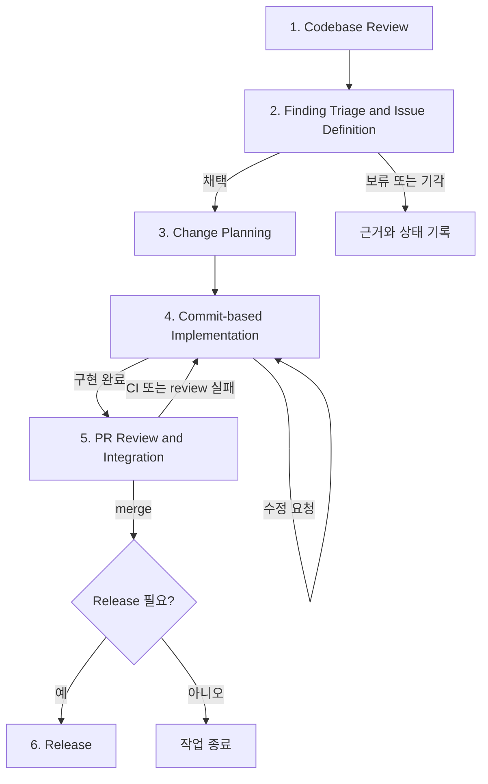

# Engineering Workflow v0.1

## 1. Purpose

이 문서는 Pizza 백엔드에서 현재 사용하는 개발 작업 방식을 반복 가능한 Working Agreement이자 SOP로 정리한다. 이상적인 조직 프로세스를 새로 설계하지 않고, 1인 개발 환경에서 사람과 AI가 실제로 협업하는 방식을 기준으로 한다.

적용 범위는 Codebase Review부터 Release Notes 작성까지다. 브랜치와 merge·release 규칙은 [Git 운영 가이드](../conventions/git-workflow.md), 테스트 작성 방식은 [테스트 작성 원칙](../conventions/testing.md)을 정본으로 따른다.

### 확인된 저장소 현황

- Pizza는 인증, 워크스페이스, 프로젝트, 스프린트, 태스크와 분석 요청 lifecycle을 소유하는 Kotlin/Spring Boot 백엔드다.
- 기능 영역은 대체로 `presentation`, `application`, `domain`, `infrastructure` 경계를 사용한다.
- 로컬 검증 task는 `ktlintCheck`, `test`, `integrationTest`, `testTc`, `bootJar`다. `testTc`에는 Docker가 필요하다.
- PR template은 `.github/pull_request_template.md`에 있으며 Issue template은 저장소에서 확인되지 않았다.
- Git history에는 최근 squash commit과 과거의 작은 commit, 중복 commit 및 branch merge가 함께 존재한다. 모든 과거 작업이 이 문서의 절차를 일관되게 따랐다고 보지는 않는다.
- GitHub Actions는 `main`, `develop`의 push와 PR에서 `ktlintCheck`, 기본 `test`를 실행한다. `integrationTest`와 `testTc`는 실행하지 않는다.
- 같은 workflow에는 `main` push 시 S3와 CodeDeploy를 사용하는 CD가 선언돼 있다. 기존 저장소에서 가져온 설정으로 Pizza에 적합한지와 실제 가용 여부는 **확인 필요**다. CD 자동화는 현재 workflow 범위로 채택하지 않는다.
- branch protection, required checks, 실제 CI/CD 성공 이력, Issue label·project 운영과 release 승인 기록 위치는 **확인 필요**다.

## 2. Principles

1. 현재 코드, 문서와 설정을 먼저 확인하고 확인할 수 없는 내용은 `확인 필요`로 표시한다.
2. 작업은 `Finding → Triage → Issue → PR → Commit` 순서로 구체화한다. 모든 Finding을 Issue로 만들지 않는다.
3. 하나의 PR은 하나의 명확한 목적을 갖고, 작업 branch의 commit은 사람이 검토할 수 있는 논리 단위로 나눈다.
4. `feature/*`, `fix/*`, `docs/* → develop`은 **Squash and merge**하여 `develop`에는 PR 전체를 나타내는 하나의 commit만 남긴다.
5. AI는 조사, 분석, 초안, 승인된 범위의 변경과 검증을 수행할 수 있다. 사람은 채택, 우선순위, 기술 결정, 코드 승인과 Git/GitHub 상태 변경을 책임진다.
6. AI는 사람의 승인 없이 staging, commit, PR 생성, merge, tag 또는 release를 수행하지 않는다.
7. 현재 commit 범위를 넘어선 문제는 임의로 고치지 않고 별도 Finding으로 보고한다.
8. 코드 동작 변경에는 회귀 테스트를 포함하고 변경 범위에 맞는 검증을 실행한다.
9. Box–Pizza API 또는 Pizza–Pickle 메시지 계약 변경은 관련 저장소의 DTO, 소비 코드와 테스트까지 검토한다. 명시적 요청 없이 Box를 수정하지 않는다.
10. `main` merge와 release는 같은 사건이 아니다. release 필요성을 사람이 별도로 판단한다.

## 3. Workflow Overview

| 상위 단계 | 포함하는 기존 활동 |
| --- | --- |
| 1. Codebase Review | 코드베이스 조사, Finding 도출 |
| 2. Finding Triage and Issue Definition | Finding 검토·우선순위 결정, Issue 정의 |
| 3. Change Planning | PR 범위 설계, 검토 가능한 commit으로 분해 |
| 4. Commit-based Implementation | commit 단위 구현, 사람 검토, 사람이 staging·commit |
| 5. PR Review and Integration | 전체 Self Review, PR 문서 작성, 사람이 PR 생성, CI 확인, 사람이 merge 결정 |
| 6. Release | release 필요성 판단, 사람이 tag 생성, Release Notes 작성 |

작은 문서 수정처럼 일부 산출물이 불필요하면 `N/A`로 표시할 수 있지만 사람의 Git/GitHub Gate는 생략하지 않는다.

## 4. Workflow Stages

### 4.1 Codebase Review

#### Purpose

변경을 제안하기 전에 현재 구조, 동작과 제약을 근거에 따라 이해하고 문제 후보를 Finding으로 정리한다.

#### Input

- 검토 목적 또는 사용자 요청
- `AGENTS.md`, `README.md`, 관련 `docs/`
- Issue/PR template, GitHub Actions, 빌드·테스트 설정
- 관련 소스, 테스트, migration, 설정과 Git history

#### Procedure

1. Pizza의 책임과 Box/Pickle 경계를 확인한다.
2. 관련 기능의 `presentation`, `application`, `domain`, `infrastructure` 흐름과 테스트를 추적한다.
3. 아래 관점 중 현재 범위와 관련된 항목을 검토한다. 관련성이 낮으면 `N/A` 또는 낮은 우선순위로 두며 모든 관점에서 억지로 문제를 찾지 않는다.

| 관점 | 핵심 질문 |
| --- | --- |
| Correctness | 요구와 불변식을 지키는가? |
| Architecture / Responsibility | 책임과 의존 방향이 적절한가? |
| Domain Boundary | Pizza, Box, Pickle과 기능 영역의 경계를 지키는가? |
| Reliability / Failure Handling | 실패, 재시도와 부분 성공을 안전하게 다루는가? |
| Transaction / Data Integrity | transaction, constraint와 상태 전이가 데이터를 보호하는가? |
| Concurrency | 경쟁, 중복 처리와 순서 역전을 고려하는가? |
| Security | 인증·인가, 입력, 비밀값과 민감 정보를 보호하는가? |
| Performance / Scalability | query, I/O와 처리량이 현재 요구에 적절한가? |
| Observability | 상태와 실패 원인을 확인할 수 있는가? |
| Testability / Maintainability | 핵심 정책을 검증하고 국소적으로 변경할 수 있는가? |
| Operability / Cost | 운영, 복구와 비용이 현재 제약에 적절한가? |

4. 각 Finding에 관찰 내용, 근거 위치, 영향 범위, 재현 조건, 위험과 미확인 사항을 기록한다.
5. 사실과 추론, 현재 결함과 개선 아이디어를 구분하고 중복 Finding을 합친다.

#### Review Criteria

- 결론마다 코드, 설정, 문서 또는 이력 근거가 있는가?
- 현재 구현, 확정 정책과 미구현 목표가 구분되는가?
- 해결책이나 작업 범위를 성급하게 확정하지 않았는가?

#### Output

검토 범위, 근거, 관점별 결과와 채택 전 Finding 목록.

#### Human Gate

사람이 검토 목적과 조사 범위가 실제 관심사에 맞는지 확인한다. Finding 자체는 아직 Issue나 작업 약속이 아니다.

#### Done Criteria

각 Finding을 독립적으로 판단할 수 있고 근거와 불확실성이 표시돼 있다.

### 4.2 Finding Triage and Issue Definition

#### Purpose

현재 프로젝트에서 해결할 가치가 있는 Finding만 선별해 검증 가능한 Issue로 만든다.

#### Input

Finding 목록, 현재 프로젝트 목표, 가용 시간과 비용·인프라 제약.

#### Procedure

1. 각 Finding의 Impact, Risk, Urgency, Effort와 현재 목표 관련성을 평가한다.
2. 필요할 때만 간단한 우선순위 framework를 사용한다. framework 적용 자체를 목적으로 삼지 않는다.
3. Finding을 `채택`, `보류`, `기각`, `확인 필요` 중 하나로 분류하고 이유를 기록한다.
4. 채택된 Finding은 다음 내용을 갖춘 Issue 초안으로 만든다.
   - 문제와 배경
   - 포함·제외 범위
   - Acceptance Criteria와 검증 방법
   - 위험, 의존성과 교차 저장소 영향
5. 저장소에서 Issue template은 확인되지 않았으므로 정해진 형식이 있다고 가정하지 않는다.

#### Review Criteria

- 기술적 흥미보다 사용자·운영 영향과 현재 목표를 우선했는가?
- 구현 방법보다 해결할 문제와 관찰 가능한 결과가 중심인가?
- 보류·기각 이유와 Acceptance Criteria가 다시 판단할 수 있을 만큼 명확한가?

#### Output

우선순위와 결정 근거가 있는 Triage 결과 및 채택된 Issue 초안.

#### Human Gate

사람이 Finding 채택, 우선순위, Issue 내용과 실제 등록 여부를 최종 결정한다.

#### Done Criteria

Issue로 승격할 Finding과 지금 다루지 않을 Finding이 구분되고, 채택된 Issue의 범위와 완료 조건이 합의돼 있다.

### 4.3 Change Planning

#### Purpose

Issue를 하나의 검토 가능한 PR 목표로 제한하고, 구현을 순서가 있는 commit 단위로 나눈다.

#### Input

승인된 Issue, 관련 설계·계약·운영 제약과 기존 테스트.

#### Procedure

1. PR의 단일 목적, 포함·제외 범위, 영향 파일과 경계, 필요한 테스트·문서·migration을 정한다.
2. PR이 크면 호환성과 의존 순서를 고려해 여러 PR로 나눈다.
3. 새로운 기술, 라이브러리, 인프라 또는 아키텍처 변경이 필요하면 다음을 검토한다.
   - 현재 문제, 요구사항과 제약
   - 가능한 대안과 trade-off
   - 운영 영향과 failure scenario
   - 테스트 가능성, 비용과 복잡도 증가
   - overengineering 가능성
4. 여러 대안 중 장기적 영향을 주는 결정은 ADR을 제안한다.
5. 각 commit의 목적, 예상 변경, 함께 포함할 테스트와 검증 명령을 순서대로 작성한다.
6. 동작 변경과 회귀 테스트는 같은 commit에 두고, 다음 commit의 작업을 미리 포함하지 않는다.

#### Review Criteria

- PR을 한 문장으로 설명할 수 있는가?
- 관련 없는 refactoring과 후속 개선이 제외됐는가?
- 각 commit이 하나의 목적을 갖고 가능한 경우 build/test 가능한가?
- migration과 application code가 안전한 순서로 적용 가능한가?

#### Output

PR 목표, scope, 기술 결정, 검증 계획과 순서가 있는 Commit Plan.

#### Human Gate

사람이 PR 범위, commit 순서와 중요한 기술 결정을 승인한다.

#### Done Criteria

포함·제외 범위와 각 commit의 완료 조건을 구현 전에 설명할 수 있다.

### 4.4 Commit-based Implementation

#### Purpose

승인된 현재 commit 범위만 구현하고 사람이 검토한 변경만 작업 branch에 기록한다.

#### Input

Commit Plan의 현재 항목, 관련 코드와 [테스트 작성 원칙](../conventions/testing.md).

#### Procedure

1. 현재 commit에 필요한 최소 코드·문서 변경과 회귀 테스트를 구현한다.
2. 적용된 Flyway migration은 수정하지 않고 새 migration을 추가한다.
3. 변경 범위에 맞는 검증을 실행한다.

| 변경 | 필수 로컬 검증 |
| --- | --- |
| Kotlin 코드 | `./gradlew ktlintCheck`, `./gradlew test` |
| `integration` 태그 테스트 관련 | `./gradlew integrationTest` |
| PostgreSQL query, mapping 또는 migration | `./gradlew testTc` |
| 빌드 또는 배포 설정 | `./gradlew bootJar`와 관련 script 검증 |
| 문서만 변경 | 링크, Mermaid, 예제 명령, `git diff --check` |

4. 범위 밖 문제는 수정하지 않고 별도 Finding으로 보고한다.
5. AI는 diff, 검증 결과, 위험과 미검증 영역을 정리한다.
6. 사람은 변경을 검토하고 `승인`, `수정 요청`, `보류`를 결정한다. 수정 요청이면 같은 commit 범위에서 다시 구현·검증한다.
7. 승인된 경우에만 사람이 대상 파일 또는 hunk를 staging하고 staged diff를 확인한 뒤 commit한다.
8. commit 메시지는 [Git 운영 가이드](../conventions/git-workflow.md)의 `<type>: 
` 형식을 따른다.
9. 다음 commit이 있으면 같은 절차를 반복한다.

#### Review Criteria

- 구현이 현재 commit 목적과 Acceptance Criteria를 충족하는가?
- 계획 밖 변경, 비밀값 또는 기존 사용자 변경을 포함하지 않았는가?
- 오류 경로, 데이터 무결성, 보안과 회귀 위험을 적절히 검증했는가?
- 의미 있는 assertion을 삭제하거나 과도한 mock으로 테스트를 통과시키지 않았는가?
- commit만 읽어도 변경 이유와 검증을 설명할 수 있는가?

#### Output

검토·검증된 작업 branch commit과 별도 Finding. 실행하지 못한 검증은 사유와 함께 기록한다.

#### Human Gate

변경 승인, Git staging과 commit은 반드시 사람이 직접 수행한다. AI는 commit 메시지 초안을 제공할 수 있지만 Git 상태를 변경하지 않는다.

#### Done Criteria

계획된 모든 commit이 사람의 검토를 거쳐 기록됐고 working tree 상태와 검증 결과가 확인됐다.

### 4.5 PR Review and Integration

#### Purpose

전체 PR의 목적, 품질과 위험을 다시 확인하고 GitHub review와 CI를 거쳐 통합 여부를 결정한다.

#### Input

base branch 대비 전체 diff, commit 목록, Issue, 로컬 검증 결과와 기존 PR template.

#### Procedure

1. AI는 PR 전체를 Self Review한다.
   - Issue와 Acceptance Criteria 대응
   - commit 사이의 중복·누락 또는 상쇄
   - API, 메시지, migration, 환경변수와 문서 동기화
   - 범위 밖 변경, debug code, 비밀값과 임시 파일
   - 테스트 결과, 미실행 검증과 남은 위험
2. 차단 Finding은 구현 단계로 되돌리고, 비차단 사항은 후속 Finding으로 분리한다.
3. AI는 `.github/pull_request_template.md`의 `Summary`, `Why`, `Changes`, `How to Test`, `Notes`에 맞춰 PR 본문 초안을 작성한다.
4. 사람은 제목, 본문, base/head branch와 공개 가능한 내용을 승인하고 GitHub에서 PR을 직접 생성한다.
5. 최신 commit의 CI를 확인한다. 현재 CI는 `ktlintCheck`와 기본 `test`만 실행하며 `integrationTest`, `testTc`, PR의 `bootJar`는 자동 실행하지 않는다.
6. CI 실패 시 원인을 분석하고 변경은 다시 계획·구현·사람 검토·사람 commit 절차를 거친다. 취소나 미실행을 성공으로 간주하지 않는다.
7. 사람은 review, CI, 로컬 검증과 운영 영향을 종합해 merge 또는 보류를 결정한다.

| 출발 branch | 대상 branch | merge 방식 |
| --- | --- | --- |
| `feature/*`, `fix/*`, `docs/*` | `develop` | **Squash and merge** |
| `develop` | `main` | Create a merge commit |
| `hotfix/*` | `main` | Create a merge commit |
| `main` | `develop` | Create a merge commit |

작업 branch의 commit은 검토 단위다. `feature/*`, `fix/*`, `docs/* → develop` 병합 시 PR 전체를 하나로 squash하고 squash commit 제목과 본문에는 PR 목적과 주요 변경을 설명한다.

현재 Actions는 `main` push에서 CD를 실행하도록 선언돼 있다. 설정이 비활성화됐다고 확인되기 전에는 `main` merge의 배포 가능성을 별도로 확인한다.

#### Review Criteria

- 전체 diff가 Issue와 승인된 scope에 일치하는가?
- 실제 실행한 검증만 PR에 통과로 기록했는가?
- 차단 review 의견과 실패 check가 없는가?
- 올바른 base branch와 merge 방식을 선택했는가?
- migration, 환경변수와 서비스 간 적용 순서가 안전한가?

#### Output

Self Review 결과, PR 본문 초안, GitHub PR, CI 결과와 사람의 merge 또는 보류 결정.

#### Human Gate

사람이 PR 제목과 본문을 승인하고 GitHub PR 생성 및 merge를 직접 수행한다.

#### Done Criteria

승인된 방식으로 merge됐거나 보류 이유와 다음 행동이 기록됐다. CI 밖 필수 검증과 남은 위험도 명시돼 있다.

### 4.6 Release

#### Purpose

merge된 변경 중 실제 release가 필요한 경우에만 버전 경계를 만들고 영향을 기록한다.

#### Input

merge된 변경, 검증 결과, SemVer 영향과 운영 준비 상태.

#### Procedure

1. 사람은 `main` merge와 별개로 release 필요 여부를 판단한다.
2. release가 필요하면 변경의 호환성 영향을 기준으로 버전을 승인한다.
3. 사람이 [Git 운영 가이드](../conventions/git-workflow.md)에 따라 정확한 commit에 `vMAJOR.MINOR.PATCH` annotated tag를 생성하고 push한다. 게시한 tag는 이동하거나 재사용하지 않는다.
4. AI는 포함 PR·Issue를 기준으로 다음 내용을 담은 Release Notes 초안을 작성한다.
   - 주요 변경과 수정
   - breaking change와 알려진 제한
   - DB migration, 환경변수와 수동 운영 조치
   - 필요한 검증 정보
5. 사람이 Release Notes를 승인하고 필요하면 GitHub Release를 게시한다.
6. rollback 절차는 현재 확정되지 않았으므로 임의로 작성하지 않고 `확인 필요`로 둔다.

#### Review Criteria

- release 목적과 대상 commit이 명확한가?
- 호환성 영향에 맞는 버전인가?
- tag에 실제 포함된 변경만 Release Notes에 기술했는가?
- CD 성공이나 운영 상태를 근거 없이 단정하지 않았는가?

#### Output

`release 불필요` 결정 또는 사람이 생성한 tag와 승인된 Release Notes.

#### Human Gate

release 여부, 버전, tag 생성과 GitHub Release 게시를 사람이 직접 결정하고 수행한다.

#### Done Criteria

release하지 않는 결정이 명시됐거나, 승인된 commit에 새 tag와 정확한 Release Notes가 연결돼 있다.

## 5. Human / AI Responsibilities

| 활동 | AI | 사람 |
| --- | --- | --- |
| 코드베이스 조사, Finding과 근거 정리 | 수행 가능 | 범위 확인 |
| 기술 조사, 대안과 trade-off 분석 | 초안 및 분석 | 기술 결정 승인 |
| Finding 채택, Issue 우선순위 | 의견 제공 | 최종 결정 |
| Issue, PR와 Commit Plan | 초안 작성 | 범위와 순서 승인 |
| 승인된 commit 범위 구현과 테스트 | 수행 가능 | 결과 검토 |
| 변경 및 PR Self Review | 수행 및 보고 | 수용 여부 판단 |
| Git staging, commit, push | 수행하지 않음 | 직접 수행 |
| PR 본문과 Release Notes | 초안 작성 | 최종 편집·승인 |
| GitHub PR 생성, merge, tag와 release | 수행하지 않음 | 직접 수행·승인 |

AI가 작업을 수행할 수 있다는 것은 독립적인 범위 확대 권한을 뜻하지 않는다. 계획 밖 변경, destructive migration, 외부 계약 변경과 중요한 기술 선택은 별도 Human Gate를 거친다.

## 6. Quality Gates

| Gate | 통과 조건 | 책임 |
| --- | --- | --- |
| Finding Gate | 근거와 영향이 명확하고 사람이 채택함 | 사람 |
| Issue Gate | 문제, scope, Acceptance Criteria와 우선순위가 승인됨 | 사람 |
| Planning Gate | PR·commit 경계, 기술 결정과 검증 계획이 승인됨 | 사람 |
| Commit Gate | 현재 commit diff와 검증 결과가 승인됨 | 사람 |
| Local Verification Gate | `AGENTS.md`의 변경 유형별 필수 검증 통과 또는 미실행 사유 기록 | AI 실행 가능, 사람 확인 |
| PR Gate | 전체 diff가 Issue와 일치하고 차단 Finding이 없음 | AI + 사람 |
| CI Gate | 최신 commit의 현재 필수 Actions check 통과 | 자동화 + 사람 확인 |
| Merge Gate | review, CI, 로컬 검증과 운영 영향 확인 완료 | 사람 |
| Release Gate | release 필요성, 버전, tag 대상과 notes 승인 | 사람 |

CI는 로컬 Quality Gate의 대체물이 아니다. 현재 Actions가 실행하지 않는 `integrationTest`, `testTc`, 범위별 `bootJar`는 해당 변경에서 별도로 확인한다.

## 7. Exception / Scope Control

- **범위 밖 Finding**: 현재 변경의 correctness나 안전을 막지 않으면 수정하지 않고 별도 Finding으로 보고한다. 차단 문제라면 범위 변경 승인을 받고 계획을 갱신한다.
- **미확인 정보**: GitHub 설정, 외부 인프라와 production 상태는 확인 전까지 `확인 필요`로 표시한다.
- **긴급 수정**: `hotfix/*`에서도 사람의 코드 승인, staging, commit, merge와 tag Gate를 유지한다. 줄인 검증과 후속 조치를 기록한다.
- **계획 변경**: Acceptance Criteria, 기술 선택 또는 PR 경계 변경은 이유와 영향을 제시하고 사람의 승인을 받은 뒤 반영한다.
- **검증 실패·미실행**: 실패와 실행 불가를 구분하고 원인, 재현 명령과 다음 행동을 남긴다. 성공하지 않은 검증을 통과로 표시하지 않는다.

## 8. Potential Improvements

다음은 현재 workflow가 아니라 후속 검토 후보이다.

1. **Pizza 전용 CI 재설정**: 기존 저장소에서 가져온 workflow를 Pizza의 branch, 권한과 실행 환경에 맞게 검증하고 CI와 CD를 분리한다. 현재 목표는 Build, Test, Lint/Static Analysis 자동화까지이며 CD는 비용 및 인프라 제약으로 제외한다.
2. **CI 검증 범위 정합화**: `bootJar`, `integrationTest`, `testTc` 중 어떤 task를 PR에서 자동화할지 실행 시간과 비용을 함께 검토한다.
3. **PR template 보완**: lint, 범위별 테스트, 미실행 사유, risk와 migration 항목 반영을 검토한다.
4. **Issue template 검토**: Finding과 Issue를 구분하면서 문제, 근거, scope와 Acceptance Criteria를 기록할 가벼운 template이 필요한지 실제 사용 후 판단한다.
5. **GitHub 보호 설정 확인**: `main`/`develop` branch protection, required checks와 허용 merge 방식을 Git 운영 가이드와 맞춘다.
6. **Release 및 rollback 운영 정리**: 승인 기록, artifact 식별, 운영 확인과 rollback 절차는 인프라 책임과 비용이 정해진 뒤 확정한다.

## 9. Workflow Changelog

Workflow는 실제 사용 중 발견된 문제를 기준으로 `Problem → Change → Result` 형식으로 개선한다. 단순 선호나 예상만으로 절차를 늘리지 않는다.

| Version | Problem | Change | Result |
| --- | --- | --- | --- |
| v0.1 | 개발 활동이 여러 문서와 대화에 흩어지고 16개 독립 단계로 표현하면 일상적으로 탐색하기 어려움 | 기존 16개 활동을 보존하면서 6개 상위 단계, Human/AI 책임과 Quality Gate로 문서화 | 실제 적용 후 확인 필요 |
